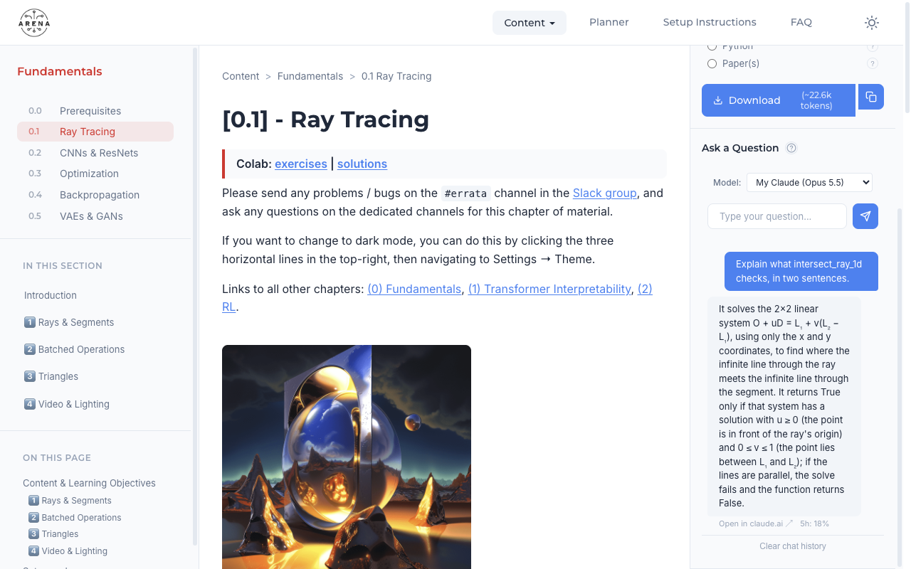
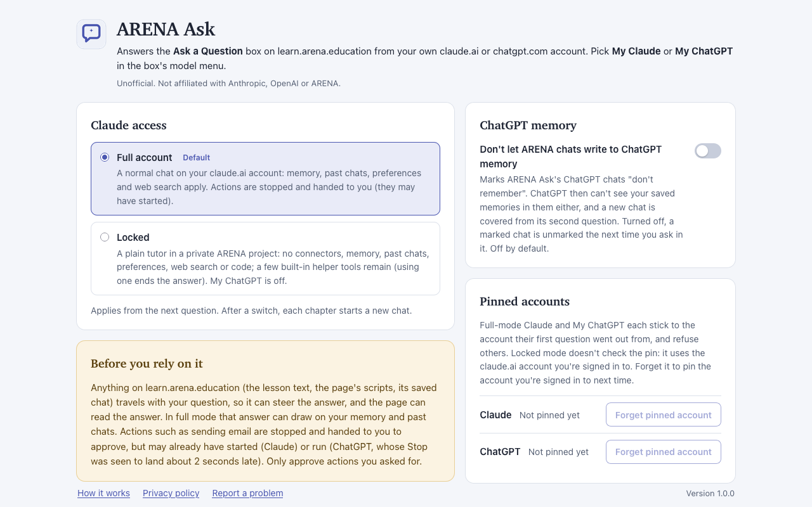

# ARENA Ask

A browser extension that answers the **"Ask a Question"** box on
[learn.arena.education](https://learn.arena.education) with **your own Claude or ChatGPT
subscription**.

> **Unofficial.** Not affiliated with, endorsed by or supported by Anthropic, OpenAI or ARENA. It
> uses your own logged-in claude.ai / chatgpt.com session, in your own browser.

Pick **My Claude (Opus 5.5)** or **My ChatGPT** in the box's model menu and ask as usual. ARENA's own
code builds the context (the sections you selected, with or without solutions), and the answer
streams into ARENA's bubble from your account, rendered as markdown, with a link to the chat.



- [What it does](#what-it-does)
- [Install](#install)
- [Settings](#settings)
- [How it works](#how-it-works)
- [Full vs locked](#full-vs-locked)
- [Security model](#security-model) and [residual risks](#residual-risks)
- [Privacy](#privacy)
- [What gets refused](#what-gets-refused)
- [Limitations and fragile points](#limitations-and-fragile-points)
- [Development](#development)

## What it does

- **Answers in ARENA's own box.** No popup, no side panel: the extension lives inside ARENA's
  sidebar. Its only page of its own is a standard Options page.
- **One chat per ARENA chapter**, per service. On claude.ai it's named `ARENA · <chapter>`; ChatGPT
  titles its own. Follow-ups continue the same chat, and they're ordinary chats in your history
  that you can open, continue or delete there. ARENA's **Clear chat history** starts a new one next
  time (the old one stays in your account).
- **Your account, not a sandbox** (the default, "full account" access): your memory, past chats,
  preferences and web search apply, as in a new chat you'd start yourself. Tools that only read run,
  with a short status line under the bubble ("Searching past chats…"). A tool call that would
  **change** something (send an email, create an event, save a memory, run code, …) is stopped and
  handed to you: "Claude wants to … — open this chat in claude.ai to approve ↗".
- **Locked mode** (opt-in, Claude only): a plain tutor with no memory, past chats, preferences, web
  search, connectors or code execution, in a private ARENA project; any tool call ends the answer.
- **Only what you typed, only when you send it.** A question goes out only after a real Send of
  yours (a click on ARENA's Send button, or Enter in its box), once, with the box holding only text
  your own typing or pasting put there. Scripts on the page can't send a question of their own or
  rewrite yours.
- **The ARENA context is attached as reference material**, prefaced as page-supplied text rather
  than instructions (on claude.ai as an `arena-course-context.md` attachment; on ChatGPT inline).
- **Footer** under each answer: **Open in claude.ai ↗** with your claude.ai usage for both limits
  (`7d 74% · 5h 4%`: the 7-day and 5-hour windows, the one closest to its limit first, amber from
  80% and red from 95%), or **Open in ChatGPT ↗** with the model that answered. ARENA keeps saving the chat history as usual; answers
  are re-rendered with their footer when you reload the page.
- **No servers of ours, no telemetry, no analytics.** See [Privacy](#privacy).

## Install

### From the stores

- **Chrome** (and Chromium browsers, 116+): Chrome Web Store, *link added once the listing is live*.
- **Firefox** (128+): Firefox Add-ons, *link added once the listing is live*.

Then sign in to claude.ai and/or chatgpt.com in the same browser profile, open a chapter on
learn.arena.education, and pick **My Claude** or **My ChatGPT** in the "Ask a Question" box.

On Firefox, host permissions are opt-in for MV3 add-ons: in `about:addons` → ARENA Ask →
Permissions, allow claude.ai, chatgpt.com and learn.arena.education.

### From source

```bash
pnpm install --frozen-lockfile
pnpm build                    # → .output/chrome-mv3
pnpm build --browser firefox  # → .output/firefox-mv3
```

- **Chrome:** `chrome://extensions` → Developer mode → **Load unpacked** → `.output/chrome-mv3`.
- **Firefox:** `about:debugging#/runtime/this-firefox` → **Load Temporary Add-on** →
  `.output/firefox-mv3/manifest.json`, then allow the three sites as above.

The unpacked Chrome build carries a fixed manifest `key`, so it always has the id
`oaancmehenbnfoofmlhodjkmbgejgaoe` (My ChatGPT recognises its own hidden frame by it). Store builds
use the store's id instead; see [STORE_LISTING.md](STORE_LISTING.md).

## Settings

Open the Options page from `chrome://extensions` → ARENA Ask → Details → **Extension options**
(Firefox: `about:addons` → ARENA Ask → **Options**).



- **Claude access**: **Full account** (the default) or **Locked**. Applies from the next question;
  after a switch, each chapter starts a new chat (a chat only continues in the mode it began in).
- **ChatGPT memory**: *Don't let ARENA chats write to ChatGPT memory* (off by default). Marks ARENA
  Ask's ChatGPT chats "don't remember". ChatGPT then can't see your saved memories in them either,
  and a new chat is covered only from its second question. Turned off again, a chat marked earlier
  is unmarked the next time you ask in it (see
  [My ChatGPT: tools](docs/DESIGN.md#my-chatgpt-tools-libgpt-toolsts)).
- **Pinned accounts**: full-mode Claude and My ChatGPT are each pinned to the account their first
  question went out from, and a question from any other account is refused. Locked mode doesn't
  check the pin: it runs in whichever claude.ai account is active. **Forget pinned account** lets
  the next question pin the account you're signed in to. Full mode only runs in a personal claude.ai account, and My
  ChatGPT only in a personal ChatGPT account (not Team, Enterprise or Edu workspaces).

The page changes nothing itself: it asks the extension's background, which accepts settings only
from the Options page (never from a script running on a website). Advanced switches (ChatGPT
model override, debug switches) live in the service worker's console; see
[docs/DESIGN.md](docs/DESIGN.md#modes) and [docs/TESTING.md](docs/TESTING.md#debug-switches).

## How it works

```
 learn.arena.education (your tab)
 ┌───────────────────────────────────────────────────────────────────────────┐
 │ ARENA's own code: fetch('/api/chat/', {messages, context, model})         │
 │     │                                                                     │
 │     ▼ ARENA Ask, in the page: answers requests for My Claude / My ChatGPT │
 │       itself (they never reach ARENA's server) with a streamed response   │
 │     │                                                                     │
 │     ▼ ARENA Ask, content script: the question must be one you typed and   │
 │       sent (trusted Send); adds the model options, renders answers        │
 └─────┼─────────────────────────────────────────────────────────────────────┘
       │ extension messaging
       ▼
 ARENA Ask background: per-chapter chat state and settings (its own IndexedDB)
       │
       ├── claude.ai page it hosts invisibly ─────▶ claude.ai's own web API, as you
       │   (offscreen frame; else a claude.ai tab)    (create/continue the chat, stream)
       │
       └── chatgpt.com page it hosts invisibly ───▶ chatgpt.com's own page, as you
           (offscreen frame; else a pinned tab)       (type the message, press Send)

 The answer streams back the same way, into ARENA's bubble.
```

1. **ARENA builds the request.** ARENA's code validates the model against its dropdown, builds
   the context and calls `fetch('/api/chat/')`. A small script ARENA Ask runs in the page claims
   only that request, only for `my-claude` / `my-chatgpt`, and answers it with a streamed response
   of its own. ARENA renders the stream and saves the history exactly as it does for its own
   models. ARENA's server never sees these questions.
2. **The gate.** The extension's content script hands the question on only if it matches a trusted
   Send of yours: a real click on ARENA's Send button or Enter in its box, with the box holding
   exactly what your own typing, pasting or dropping produced, within 60 s, for the chapter the
   page was loaded for and the model you picked. It is a one-shot token.
3. **The background** looks up the chapter's chat and reaches a *relay*: ARENA Ask's content
   script running **inside** claude.ai or chatgpt.com, where everything is same-origin with your
   session. On Chrome that page is an invisible frame in the extension's offscreen document; if
   the frame can't be used (logged out, a Cloudflare challenge), a claude.ai tab or a pinned,
   inactive tab of its own is used instead. Firefox has no offscreen documents and uses tabs.
4. **claude.ai**: the relay calls claude.ai's internal web API (the one its web app uses): it
   creates the chapter's chat (or continues it), checks its settings, sends the question with the
   ARENA context attached, and streams the answer. Tool calls are classified as they start; see
   [Full vs locked](#full-vs-locked).
5. **chatgpt.com**: chatgpt.com protects its conversation request with tokens and a proof-of-work
   its own page computes, so ARENA Ask never sends that request itself. It **drives chatgpt.com's
   own page**: moves it to the chapter's chat, types the message into the composer and presses
   Send. A script in that page checks the outgoing request (only the message ARENA Ask typed, to the
   expected chat, from the checked account) and passes the answer stream back, which the relay
   parses strictly: only the assistant's visible answer text reaches ARENA.
6. **Rendering**: when the answer completes, ARENA Ask renders it with a small escape-first markdown
   renderer and an allowlist sanitizer, adds copy buttons and the footer.

The full walk-through, with every check, is in [docs/DESIGN.md](docs/DESIGN.md). Selectors and
endpoints live in one place each: ARENA's in `lib/arena-selectors.ts`, claude.ai's in
`lib/claude.ts`, chatgpt.com's in `lib/gpt-relay.ts`.

## Full vs locked

**Full account (default)**, for Claude and ChatGPT alike:

- A plain chat on your **personal** account (team and enterprise organizations are refused), with
  your memory, past-chat search, profile preferences and web search, like a new chat you'd start
  in the web app. On claude.ai, code execution is switched **off** in these chats (the web app's
  own default for a new chat), confirmed from claude.ai's reply before anything is sent.
- Tools that only **read** run (web search, past-chat search, reads of Gmail/Calendar/Drive where
  offered), with a status line under ARENA's bubble. What counts as a read: claude.ai's own read
  tools and connector tools on a fixed list of known reads, by exact name. A claude.ai tool the
  extension doesn't know is judged by the words of its name (split at `_`, `-`, capitals and
  digits): it runs as a read only if its first or last word is a read verb (`search`, `list`,
  `get`, `fetch`, …) and no word is an action verb, a risky word (`url`, `query`, `code`, …) or a
  conjunction, and no action verb of five or more letters is run into a word (`getandcreate`).
  Shorter verbs run together aren't caught: `get_sendmail` counts as a read. Everything else, including any unlisted connector tool
  and any other unknown tool, is an **action**: stopped at its start and handed to you with a link
  to approve it in claude.ai / ChatGPT, plus what the stop achieved (checked, not assumed) and
  "Only approve this if you asked for it — text on the ARENA page can influence Claude."
- claude.ai doesn't offer connector tools (Gmail, Calendar, …) to chats created through its API,
  so in practice Claude's reads are web search and your past chats. ChatGPT may use your
  connected apps.

**Locked** (Claude only; set it on the Options page):

- The chat lives in a private **ARENA** project the extension creates, without instructions,
  knowledge or project memory, and is locked down before anything is sent: no memory, past chats,
  web search, connectors, Research or code execution, verified from claude.ai's reply (it fails
  closed). Profile preferences are turned off when the chat is created (claude.ai's reply doesn't
  show that setting, so it isn't verified).
- Any tool call ends the answer at once ("Claude tried to use a tool; ARENA Ask blocks tools in
  locked mode"). claude.ai runs its built-in tools itself, so that one call may already have run.
- **My ChatGPT is unavailable** in locked mode: chatgpt.com has no per-chat lockdown to rely on (its
  request fields for disabling tools are ignored, tested), so a "locked" ChatGPT would be a promise
  the extension can't keep.

## Security model

What ARENA Ask guarantees:

- **Only your questions.** A question goes out only after a trusted Send of yours, once, within
  60 s, from the chapter the page was loaded for, to the service you picked, with the box holding
  only text your own editing produced since your last question (your keystrokes where you put the
  caret, your pastes, your IME input, drops from outside the page, undo/redo among those). A script
  on learn.arena.education can't send a question you didn't type, rewrite or reorder yours, send it
  again later, or route it to the other service. The gate is `lib/gesture.ts`.
- **Only on ARENA's course pages.** Nothing runs on ARENA's pull-request previews (`/pr-preview/`,
  `/preview/`, which render untrusted markdown on the same origin), including encoded or
  case-changed variants of those paths.
- **The page can't change the settings.** The mode, the pinned accounts and each chapter's chat
  live in the background's own IndexedDB, which page and content scripts can't reach. They change
  only from the Options page (whose messages the background accepts only from that page) or the
  service worker's console.
- **No account ids reach the page or the logs.** Account ids stay inside the extension (the
  claude.ai organization full mode is pinned to is the only account id it keeps; ChatGPT's pin is a
  hash). Chat ids do reach ARENA's page: the footer under each answer (and any hand-off note) links
  to the chat (`claude.ai/chat/<id>`, `chatgpt.com/c/<id>`), so scripts on that page can read the
  chat's id, along with the model label and the usage figure shown there. The logs carry chapters,
  timings and error codes, never cookies, tokens, ids or message content.
- **Hidden frames are ARENA Ask's only.** To load claude.ai / chatgpt.com invisibly, session rules
  strip `X-Frame-Options` / CSP only from frames this extension itself loads outside any tab. Your
  own tabs, and those sites framed anywhere else, are unaffected.
- **ChatGPT sign-out protection.** chatgpt.com's own code signs you out everywhere when a hidden
  page of it gets a 401; in ARENA Ask's frame and pinned tab, sign-out requests are blocked, and the
  question ends with "ChatGPT session expired" instead. In your own chatgpt.com tabs, ARENA Ask does
  nothing at all.

### Residual risks

Read these before relying on full mode. The Options page summarises them in one paragraph.

- **Text on learn.arena.education can steer the answer, and the page can read it.** Scripts on
  ARENA's site run in the same page as ARENA's own code, so they can plant instructions in what
  ARENA hands over with **your** question (the lesson context it builds, the chat history it saved),
  and they can read the answer ARENA shows. In full mode that answer can draw on your memory, past
  chats and preferences, and read tools can carry data out (a web search or fetch goes to a query or
  URL an injected instruction may choose). ARENA Ask makes this harder, not impossible: the context
  is prefaced as page-supplied reference text, earlier chat is escaped and only questions you
  actually sent are marked as yours, and nothing can change anything without you (below).
- **Actions are stopped at their start, not prevented.** For Claude, the call is caught as it
  starts and claude.ai is told to stop; the note says "stopped it before it ran" only when
  claude.ai's copy of the turn shows no result from it, and "the action may have started"
  otherwise. For **ChatGPT, actions may already have run**: chatgpt.com runs a tool as soon as the
  call is complete, and its Stop lands about 2 seconds late (a memory write was seen to go through
  this way). The note then says "the action may have run". **Only approve actions you asked for.**
  If an ARENA page ever looks off, use Locked mode for Claude, don't use My ChatGPT there, or
  disconnect write access to your ChatGPT apps.
- **Memory.** claude.ai and ChatGPT build memory from your chats, so text from an ARENA page that
  ends up in a full-mode chat may be summarised into your memory, without any tool call to stop.
  Review your memory in their settings if something looks off. (ChatGPT: the Options page's memory
  switch marks ARENA chats "don't remember", from a chat's second question.)
- **What you paste.** The gate proves you pasted the text, not who wrote it: a page can put
  anything on your clipboard through its copy buttons. You see it in the box before you send.
- **An early Send.** A page can move ARENA's Send button under your pointer (or make it
  transparent), so the text you've typed so far goes out early. It can't change that text.
- **The hidden frames run without claude.ai's / chatgpt.com's Content Security Policy** (only
  those frames, only loaded by this extension). The ChatGPT send guard hardens against chatgpt.com's
  own code misbehaving; it is not a boundary against hostile code running as chatgpt.com.
- **Undocumented APIs.** The extension depends on claude.ai's and chatgpt.com's internal web APIs
  and page structure. It fails closed where it can (refuses rather than sends), but a change on
  their side can break it; see [Limitations](#limitations-and-fragile-points).

The complete model, including every check the gate makes, is in
[docs/DESIGN.md, Security model](docs/DESIGN.md#security-model).

## Privacy

ARENA Ask has **no servers, no analytics and no telemetry**, and loads no remote code. Your
questions, the ARENA context and ARENA's earlier chat go only to the service you picked (claude.ai
or chatgpt.com), from your browser, with your own session. The extension keeps small local state
(each chapter's chat id, hashes of the questions you sent, your settings, the pinned accounts) in
the browser. Full details: [PRIVACY.md](PRIVACY.md).

## What gets refused

ARENA shows "ARENA Ask couldn't send that question." plus the reason:

| Situation | Message (short) |
|---|---|
| Another extension (Grammarly, a text expander, autocorrect) or the page changed the text | clear the box and type or paste it again |
| Undo/redo brought back text not typed since your last question | clear the box and type or paste it again |
| The browser restored your draft (Back without the back/forward cache, a Memory Saver or crash reload) | select it and retype or paste it |
| The text of a question already sent was put back without typing | clear the box and type or paste it |
| Enter while an IME was still composing (ARENA itself would send the half-composed text) | finish composing (confirm the IME), then press Enter again |
| Ctrl/Cmd/Alt+Enter or a held-down Enter (ARENA sends on these, ARENA Ask doesn't) | use the Send button or plain Enter |
| A click that didn't land on the (visible) Send button itself, or one forwarded from a label | click the Send button or press Enter |
| Space/Enter on a Send button the page focused (not you, with Tab) | click the Send button, or press Enter in the box |
| Text dragged from the page itself and dropped in the box | type or paste your question instead |
| The page's chapter data or address isn't the chapter it was loaded for | reload the page and ask again |
| The dropdown shows (or ARENA's request names) a model you didn't pick | pick the model again, then send |
| More than 60 s between Send and ARENA's request, or no Send at all | the generic "only sends a question you typed…" |
| A team/enterprise account, or not the pinned one | switch account, or Forget pinned account in the Options |

## Limitations and fragile points

**Fragile by nature.** ARENA Ask is built on things nobody promised to keep stable:

- **claude.ai's internal, undocumented web API** (`lib/claude.ts`, `lib/sse.ts`). claude.ai's web app
  itself now creates chats through a different (binary RPC) service; the REST API ARENA Ask uses
  could be retired. ARENA Ask then sets the web app's defaults for a new chat itself.
- **chatgpt.com's page and internal stream format** (`lib/gpt-relay.ts`, `lib/gpt-stream.ts`): the
  composer and Send button selectors (with English labels as fallbacks), the answer stream's
  delta encoding, the client-side router. A redesign can break My ChatGPT until it's updated.
- **ARENA's page** (`lib/arena-selectors.ts`): the ids `#chat-model`, `#chat-input`,
  `#chat-send-btn`, `#chat-messages`, `#chat-clear-btn`, the `/api/chat/` request ARENA's code
  makes, and its history format in localStorage. If ARENA Ask stops working after an ARENA update,
  the fix almost always lives in that one file.

When one of these changes, ARENA Ask refuses or ends the answer with a message rather than guess.

**By design:**

- The input gate is strict. Extensions that rewrite the question box (Grammarly, text expanders,
  autocorrect, translation tools) make it refuse; clear the box and type or paste again, or turn
  that extension off for learn.arena.education. A draft the browser restores doesn't count as typed.
- Sending with the keyboard from the Send button works after Tab (Space or Enter); a button that got
  focus any other way is refused: click it, or press Enter in the box. Dragging lesson text into the
  box is refused (paste it instead). Undo/redo only works back to what you typed since your last
  question.
- A question must reach ARENA Ask within 60 s of Send (ARENA fetches the selected sections first).
- Full mode only runs in the personal account it was first used with (Forget pinned account to
  change it); team and enterprise accounts are refused.
- Answers are capped at 5 minutes (10 once a tool ran) and 200,000 characters; in locked mode any
  tool call ends the answer. An answer cut off mid-stream keeps its partial text with an
  "⚠️ Interrupted" note.
- Stopped questions (and their notes) are kept out of later turns; after 32 of them in a chapter's
  chat, the next question starts a new chat, without the earlier ARENA chat.
- Claude's model is fixed to Claude Opus 5.5 (`lib/provider.ts`); ChatGPT uses your page's default
  model. LaTeX and images in answers are shown as text. The Claude footer's usage figures are the
  7-day and 5-hour windows claude.ai reported with that answer (a snapshot, not live); a window
  claude.ai didn't report is left out.
- The dropdown remembers the model you last picked (in any ARENA tab) and shows it again after a
  reload. Earlier answers keep the footer of the service that answered them, so "My ChatGPT" in
  the dropdown next to an "Open in claude.ai" footer is expected: the next question goes to what
  the dropdown shows.

**My ChatGPT specifically:**

- One ChatGPT question at a time across chapters (it drives one page); a second waits up to 2
  minutes with "Waiting for your other ChatGPT question to finish…".
- The ARENA context goes inline (an attachment would land in your ChatGPT file library), capped at
  250,000 characters with the question and earlier chat; select fewer sections beyond that.
  chatgpt.com sees your text markdown-escaped (`\#`, `\*`), which it reads fine.
- Actions it runs server-side can complete before its ~2 s Stop lands (see
  [Residual risks](#residual-risks)). Connector reads are only allowed when that turn's app listing
  names the app; otherwise they're handed off like writes.
- If ARENA Ask's chatgpt.com tab is closed mid-answer, nothing stops that answer on chatgpt.com.

**Browsers:**

- **Chrome** uses the invisible frames; if a frame can't be used (for example, third-party cookies
  blocked for it), a pinned claude.ai / chatgpt.com tab is used instead. In incognito (if you allow
  the extension there), Claude questions go only through a claude.ai tab you open in incognito.
- **Firefox** has no offscreen documents, so it always uses tabs: an open claude.ai tab, or ARENA
  Ask's own pinned one in the default container. In another container or a private window, open
  claude.ai there yourself. Firefox has had far less live testing than Chrome: the add-on, its
  Options page and the ARENA side are checked in Firefox 154, but not yet a real question.

## Not affiliated

ARENA Ask is an independent, unofficial project. It is not affiliated with, endorsed by or
supported by Anthropic (Claude), OpenAI (ChatGPT) or ARENA (learn.arena.education). "Claude",
"ChatGPT" and "ARENA" are the names of their owners' products; they are used here only to say what
the extension works with. Using claude.ai and chatgpt.com through ARENA Ask is ordinary use of your
own account, subject to those services' terms.

## Development

```bash
pnpm install --frozen-lockfile   # exact versions from pnpm-lock.yaml
pnpm test                        # vitest (jsdom)
pnpm exec tsc --noEmit           # types
pnpm build                       # .output/chrome-mv3 (unpacked, fixed key)
pnpm build --browser firefox     # .output/firefox-mv3
pnpm dev                         # Chrome with the extension, hot reload
pnpm icons                       # re-rasterize assets/icon.svg → public/icon/*.png
pnpm zip:store                   # the store zips (see STORE_LISTING.md)
```

Built with [WXT](https://wxt.dev) and TypeScript; no runtime dependencies. Where things are:

| Path | What |
|---|---|
| `entrypoints/arena-page.content.ts`, `lib/page-intercept.ts` | the MAIN-world `fetch` wrapper on learn.arena.education |
| `entrypoints/arena.content.ts`, `lib/gesture.ts` | the bridge, the dropdown options, the trusted-Send gate, rendering |
| `entrypoints/background.ts` | per-chapter state, transports, settings route, console helpers |
| `entrypoints/options/`, `lib/settings.ts` | the Options page and the background's settings route |
| `entrypoints/claude-relay.content.ts`, `lib/relay.ts`, `lib/claude.ts`, `lib/lockdown.ts`, `lib/tools.ts`, `lib/sse.ts` | the claude.ai relay: API calls, locked mode, tool classifier, stream guard |
| `entrypoints/chatgpt-*.content.ts`, `lib/gpt-*.ts` | My ChatGPT: page driver, send guard, stream parser, tool classifier |
| `entrypoints/offscreen/`, `lib/transports.ts` | the invisible frames and the tab fallbacks |
| `lib/arena-selectors.ts` | every ARENA selector, endpoint and storage key |

- [docs/DESIGN.md](docs/DESIGN.md): the internals and the full security model.
- [docs/TESTING.md](docs/TESTING.md): unit tests, debug switches, logs, live QA with a CDP harness,
  the QA checklist, how the store screenshots were taken.
- [STORE_LISTING.md](STORE_LISTING.md): store builds, listing text, permission justifications.
- [CHANGELOG.md](CHANGELOG.md).

### Building from source (for Firefox Add-ons review)

Requirements: Node.js 22.12 or later (built with 24.15.0) and pnpm 10 (built with 10.34.3), on
macOS, Linux or Windows.

```bash
pnpm install --frozen-lockfile
pnpm zip:firefox
```

This writes `.output/firefox-mv3/` (the add-on's files) and `.output/arena-ask-1.0.1-firefox.zip`,
the same package as the one submitted (checked: a rebuild from the sources zip is byte-identical).
The build bundles the TypeScript sources with WXT/Vite; no code is fetched at build time or at run
time. pnpm 10 may warn that it ignored the build scripts of `esbuild` and `spawn-sync`; the build
doesn't need them.

## License

[MIT](LICENSE) © 2026 Fernando Smith
